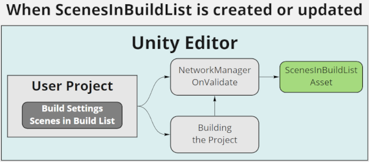
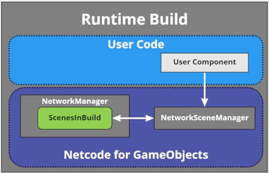

# Replace Scene Registration with Scenes in Build List
[feature]: #feature

- Start Date: `2021-07-20`
- RFC PR: [#0000](https://github.com/Unity-Technologies/com.unity.multiplayer.rfcs/pull/0000)
- SDK PR: [#0000](https://github.com/Unity-Technologies/com.unity.multiplayer.mlapi/pull/0000)

# Summary
[summary]: #summary

The original NetworkManager Scene registration process was designed to provide users with a means to control which scenes declared within the build settings “scenes in build list” could be loaded during an active session. While this did accomplish the underlying purpose of active session scene loading control, this proposal will outline a new approach that only requires users to populate the “build settings scenes in build list” (as they normally would) while also providing users with the ability to dynamically control which scenes are valid or not based on current game state.

# Motivation
[motivation]: #motivation

The more recent NetworkSceneManager updates allowed for the use of SceneAssets in place of the scene name.  This did help reduce the required user maintenance time by not requiring a user to update the registered scene names within the NetworkManager if they changed the name of a  SceneAsset.  However, this still required users to maintain two lists and the registered scenes approach was a globally static definition that did not allow for a more granular scene loading verification process.    


# Guide-level explanation
[guide-level-explanation]: #guide-level-explanation

By treating all of the scenes in the build list as registered scenes and providing a scene verification callback handler that was always invoked prior to loading a scene,  users now have one location to register scenes and they can customize the scene verification process.  The new scene verification process provides users, depending upon the user’s custom verification implementation, the ability to associate a specific subset of scenes in the build list based on current game state.  

This approach still required some kind of master registered scenes list in order to provide the very basic scene verification checks of whether the scene name being requested for load (server side) or being commanded to load (client side) was even included in the build.  Since the “scenes in build list” is only available to the editor, a new scriptable object type (ScenesInBuild) was created as a runtime container to hold the list of scenes included in the build.  To further simplify the scene registration process, a ScenesInBuild asset is automatically created for the user if one does not exist.   
  


The asset created will always be called “ScenesInBuildList” and is always initially created within the root Asset folder of the user’s project.  The ScenesInBuildList asset will be created or updated upon the assignment of a NetworkManager component to a GameObject, loading a scene (in the editor) that contains a GameObject with the NetworkManager component, or during the build process if any scene(s) included in the “scenes in build list” contains a GameObject with a NetworkManager component.

Once created, the user can choose to move the ScenesInBuildList asset to any sub-folder within their project’s Asset folder.  If a user creates a duplicate copy of the ScenesInBuildList asset and forgets to delete one of the ScenesInBuildList assets, whenever it is synchronized with the user’s project’s “scenes in build list” a console log warning will be generated telling the user that only one copy of the ScenesInBuildList asset should exist and the message will provide a path to the first version of the ScenesInBuildList asset that will be used until the user removes the unwanted duplicate asset.  Once the duplicate asset is removed, the remaining ScenesInBuildList asset will become the default.

All NetworkManager instances will point to the same ScenesInBuildList asset, and the NetworkSceneManger has been updated to use the ScenesInBuild.Scenes list exclusively in place of the previous NetworkConfig.m_RegisteredScenesList that was based on the NetworkManager scene registration process.  This means the scene index values are now in alignment with the “scenes in build list” scene indices.



In addition, the NetworkConfig.m_AllowRuntimeSceneChanges property was removed as it no longer applies.  You either have the scenes you are going to use in the build settings “scenes in build list” or you do not.  

*Note: The only exception to this rule is for unit tests that need to manually load scenes should set the ScenesInBuild.IsTesting to true which lets the ScenesInBuild class know a unit test is running and to ignore any scene changes from that in the ScenesInBuildList asset.*


User defined scene verification occurs if the user has assigned a callback handler for NetworkSceneManager.VerifySceneBeforeLoading.  The callback is provided with the scene index, scene name, and the mode in which the scene is being loaded.  If the user’s game logic determines it is a valid scene to load then the callback should return true to continue the load scene event process, however if it is not valid the callback should return false and the scene in question will not be loaded.  If the callback is assigned, this process will occur on both server and client(s).


# Reference-level explanation
[reference-level-explanation]: #reference-level-explanation
Other than not having to register scenes with the NetworkManager,  there are a few aspects to this update that we should review:
* Because UnityEngine.SceneManagement.SceneManager requires all scenes that can be loaded to be registered in the “scenes in build list”, we no longer need the NetworkConfig.AllowRuntimeSceneChanges property.
* Users need to assign a callback handler to NetworkSceneManager.VerifySceneBeforeLoading in order for pre-loading scene verification to occur.  If nothing is assigned, then all of the “scenes in build list” can be loaded at any time during an active network session.
* Unit tests that load any scenes that are not registered with the “scenes in build list” are required to set the ScenesInBuild.IsTesting value to true while the unit test is running and false once the unit test is complete.  *It is recommended to do this in UnitySetUp and UnityTearDown attribute decorated methods.*

## **Verifying Scenes** 

Implementing the VerifySceneBeforeLoading delegate is a relatively straightforward approach. Consider the following example:

```C#
using System;
using System.Linq;
using System.Collections.Generic;
using UnityEngine.SceneManagement;
using Unity.Netcode;

[Serializable]
public class ValidGameLevelScene
{
    public string SceneName;
    public LoadSceneMode LoadMode;
}

public class GameLevelSceneVerifyComponent : NetworkBehaviour
{
    public List<ValidGameLevelScene> ValidSceneNamesForCurrentLevel;

    private bool OnVerifySceneBeforeLoading(int sceneIndex, string sceneName, LoadSceneMode loadSceneMode)
    {
        return ValidSceneNamesForCurrentLevel.Select(c => c).Where(c => c.SceneName == sceneName && c.LoadMode == loadSceneMode).Count() > 0;
    }

    public override void OnNetworkSpawn()
    {
        NetworkManager.SceneManager.VerifySceneBeforeLoading = OnVerifySceneBeforeLoading;

        base.OnNetworkSpawn();
    }
}
```
The example above demonstrates how users can quickly create a customized scene verification component that can be used several times in various different scenes throughout a users project.  Each unique instance of the component dictates which scenes a server and/or client can load from the available scenes in the build list.  Each time a new instance is created, the VerifySceneBeforeLoading is reassigned and a new user defined set of “scene loading rules” are loaded relative to the scene containing the GameLevelSceneVerifyComponent instance.

## **Unit Tests**

We had discussed that when writing unit tests that might load scenes not listed in the “scenes in build list” you must set the ScenesInBuild.IsTesting to true.  Consider the following code snippets from an existing unit test:

```C#
    [UnitySetUp]
    public IEnumerator Setup()
    {
        ScenesInBuild.IsTesting = true;
        SceneManager.sceneLoaded += OnSceneLoaded;
 
        var execAssembly = Assembly.GetExecutingAssembly();
        var packagePath = PackageInfo.FindForAssembly(execAssembly).assetPath;
        var scenePath = Path.Combine(packagePath, 
        $"Tests/Runtime/GlobalObjectIdHash/{nameof(NetworkPrefabGlobalObjectIdHashTests)}.unity");
 
        yield return EditorSceneManager.LoadSceneAsyncInPlayMode(scenePath, 
        new LoadSceneParameters(LoadSceneMode.Additive));
    }    
 
    [UnityTearDown]
    public IEnumerator Teardown()
    {
        ScenesInBuild.IsTesting = false;
        SceneManager.sceneLoaded -= OnSceneLoaded;
 
        if (m_TestScene.isLoaded)
        {
            yield return SceneManager.UnloadSceneAsync(m_TestScene);
        }
    }
```
This unit test uses the EditorSceneManager to load its scenes.  All that needs to be taken into account are the two lines of code in the Setup and Teardown methods that set the ScenesInBuild.IsTesting to true (Setup) and then to false (Teardown).

# Drawbacks
[drawbacks]: #drawbacks

* If a user decides to have multiple projects and each project contains a different set of scenes in the “scenes in build list”, then this could become problematic.  However, this really depends upon the user’s requirements and rationale behind this type of configuration.  If it is all for platform specific separation, then it could be recommended to use additive scenes in combination with runtime scene verification that is based on platform type.
* All scene names will be contained within the ScenesInBuildList asset as unencrypted strings in the same “scenes in build list” index order, and this proposal does not take into account any form of additional user-defined serialization and deserialization hook that would allow a user to further secure the scene name list.
* This implementation does not take into account addressables, but that is beyond the scope for this initial effort.

# Rationale and alternatives
[rationale-and-alternatives]: #rationale-and-alternatives

For the short term, this provides the user with additional dynamic/runtime scene verification capabilities while also removing the need to maintain two sets of scene lists.  The alternative would be to not provide this functionality and stick with the update NetworkSceneManager’s SceneAsset registration process.

# Prior art
[prior-art]: #prior-art

There are some articles that discuss potential ways to use a ScriptableObject as a way to store the “scenes in build list”:
* [Retrieving the names of your scenes at runtime with Unity](https://davikingcode.com/blog/retrieving-the-names-of-your-scenes-at-runtime-with-unity/)
  * Closest to the current implementation
* [Better scene workflows with Scriptable Objects](https://resources.unity.com/developer-tips/sceneworkflows-with-scriptable-objects)
  * Discusses some of the challenges between “scenes in build list” and runtimeReferences a GithubGist link that references [Unity-Scene-Reference](https://github.com/JohannesMP/unity-scene-reference)

# Unresolved questions
[unresolved-questions]: #unresolved-questions

* How could this implementation be modified to handle addresables?
* Should this implementation include more than just the list of scene names?
* Should the scene verification process include the client identifier as part of the verification process?  Is there any other information that might be useful for verification purposes?
* Should we provide a way for the user to secure the ScenesInBuildList (i.e. encrypt and decrypt)?Should user level code have access to the ScenesInBuildList asset from the current NetworkManager instance?

# Future possibilities
[future-possibilities]: #future-possibilities

This implementation provides a 1:1 relationship between scene names and “scenes in build list” indices values. If/when we decide to derive NetworkSceneManager from the SceneManagerAPI, this will provide us with the ability to handle the broad stroke scene validation when a user decides to load a scene by index value as opposed to scene name.  Additionally, we could continue to expand upon the ScensInBuild asset that allows a user to include SceneGroup registrations.  SceneGroup registrations would include at least one base scene (loaded in single mode) and any number of additively loaded scenes.  This would allow users to simply specify: “Load this scene group” and all scenes registered within the SceneGroup would be loaded in the same order and mode as they are defined within the SceneGroup.

