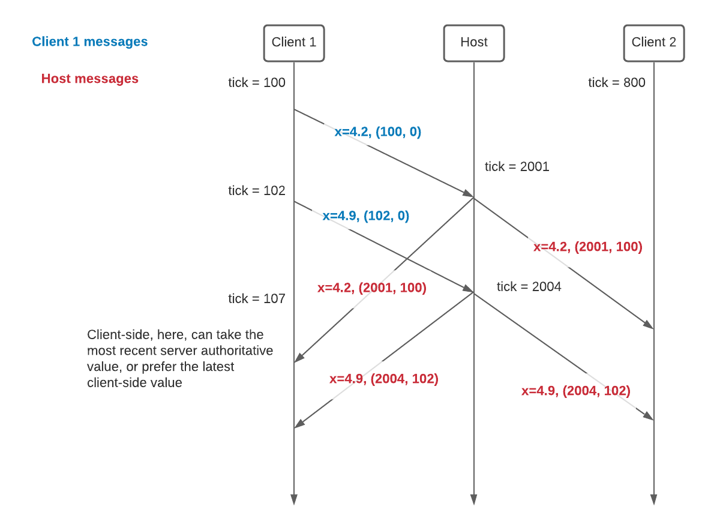

- Feature Name: `synced_networked_var`
- Start Date: 2021-02-12
- RFC PR: [Unity-Technologies/com.unity.multiplayer.rfcs#0000](https://github.com/Unity-Technologies/com.unity.multiplayer.rfcs/pull/0000)
- Issue: [Unity-Technologies/com.unity.multiplayer#0000](https://github.com/Unity-Technologies/com.unity.multiplayer/issues/0000)

# Summary
[summary]: #summary

Make the NetworkedVariables synchronized with the tick system.

We suggest two elements:
- Changing `NetworkedBehaviour::NetworkedBehaviourUpdate()` so that the function runs at most one per Network Tick. When called more than once per Network Tick, it would simply return.
- NetworkedVariables carrying two pieces of information with their delta updates:
    - The local tick at which a variable was modified
    - The remote tick at which the variable was modified, when the host relays the variable to clients, including the source client    

# Motivation
[motivation]: #motivation

In a client-server topology, any client and the server can modify NetworkedVariables. The server receives the clients' changes and send them back to all of the clients. In order to retain generality, we'll assume that any variable can be modified by anyone and that the server can also modify the variable as they are received and sent. For example, we could have server-driven physics over client-driven character movement.

It is proposed that the NetworkedVariable interpolation algorithm be easily customizable and that the user can chose whether it supports client or server side authoritative mechanics. To account for this, each NetworkedVaraible will keep track of the following:
- When it was modified by a given client
- When the server updated or transmitted it

This will enable better client-side interpolation, lag compensation, and in the future provide the required flexibility for new systems (i.e. like snapshotting).

This provides enough information such that the client can distinguish between its own updates from that of server-side adjustments (i.e. like physics).

This will keep the overall bandwidth usage in check, preventing frequent updates for NetworkedVariables.

This sets up MLAPI for upcoming features like snapshot.

# Dependency
[dependency]: #dependency

This feature depends on a Tick System that would provide:
- A discrete measurement of the local time, based on an integer number of tick elapsed
- The tick number being updated at the very beginning of each frame and stable throughout the frame
- A tick that is based on the real time elapsed since a fixed point in the past 

# Guide-level explanation
[guide-level-explanation]: #guide-level-explanation

Some definitions:

#### Local tick
The tick number at which a variable was modified, relative to the tick system on this machine. If I get an update for a variable I changed, this tell me: when did I change it?

#### Remote tick
The tick number at which a variable was relayed, relative to the tick system on the remote machine. If I get an update from the server, this tells me the local tick on the server when it sent the update.

#### Network Tick wrapping 

The tick value sent will be a rolling value, probably 8- or 16-bit. This will be hidden internally, but will keep the bandwidth usage in check.

# Reference-level explanation
[reference-level-explanation]: #reference-level-explanation

We suggest changing:

- in `Runtime/NetworkedVar/INetworkedVar.cs`, `INetworkedVar` `ReadField()` to become

      public void ReadField(Stream stream, ushort localTick, ushort remoteTick);

- in `Runtime/NetworkedVar/INetworkedVar.cs`, `INetworkedVar` `ReadDelta()` to become

      public void ReadDelta(Stream stream, bool keepDirtyDelta, ushort localTick, ushort remoteTick);

- `NetworkedVar` to include two new properties:

      public ushort LocalTick { get; internal set; }
      public ushort RemoteTick { get; internal set; }
      
 - `SendTickrate` and `LastSyncedTime` to be removed from `NetworkedVar`

Below diagram shows a couple NetworkedVariable updates with example tick numbers.

The diagram below shows the function calls that would lead to the local and remote ticks being written to the stream, on the send side.

The diagram below shows the function calls that would lead to the local and remote ticks being set in the NetworkedVar, on the receive side.

# Drawbacks
[drawbacks]: #drawbacks

This increases slightly the bandwidth usage of _individual_ NetworkedVariable update it also renders the NetworkedVariables system dependent on the tick system.

# Rationale and alternatives
[rationale-and-alternatives]: #rationale-and-alternatives

This proposal makes the NetworkedVariables a bit more complex. But it sets a foundation over which other features can be built without causing the NetworkedVariables to be modified further. Snapshotting, client-side interpolation, lag compensation, replay and rollback are examples features that will leverage this. 

# Prior art
[prior-art]: #prior-art

This is a pretty typical setup seen in other proprietary network engines.

# Unresolved questions
[unresolved-questions]: #unresolved-questions

Do we require the tick to advance at the same rate on the client and server machine. Can we support an asymmetry in tick rate between client and server? Is this important?

Different clients will have a different relative ticks. When the host and client receive the NetworkedVariables, they can flip the local and remote tick. As such, if Alice sends an update to the Host and gets her value back, the local tick is valid for her. This update would not be valid for a different client, though. As such, when the snapshot and interpolation systems are fleshed out, a fix might be needed. It will probably involve marking the NetworkedVariables with a ClientId or client index. We prefer to leave this detail out of this RFC, for now. 

# Future possibilities
[future-possibilities]: #future-possibilities

The following systems will build up on this:
- Snapshot system
- Replay and rollback
- Interpolation and Extrapolation
- Lag compensation
